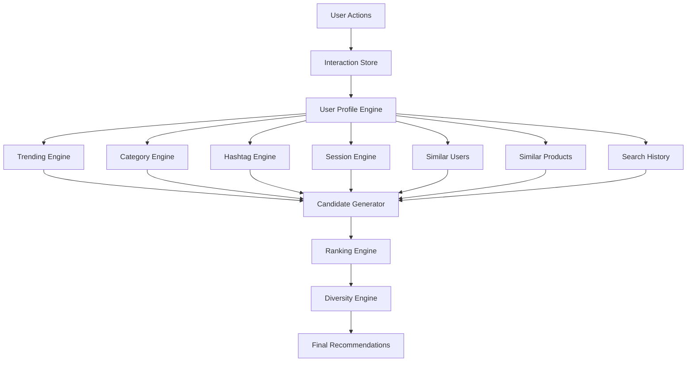

# 🧠 SynapseRec

<div align="center">

# 🚀 SynapseRec

### Real-Time Hybrid Recommendation Engine

**Trending + Collaborative Filtering + Content Similarity + Session Intelligence + Embeddings**


### Built for Next-Generation Recommendation Systems

*Netflix Inspired • Gorse Inspired • Built from Scratch*

</div>

---

# 🎯 What is SynapseRec?

SynapseRec is a hybrid recommendation engine that combines:

✅ Content-Based Filtering

✅ Collaborative Filtering

✅ Session-Aware Recommendations

✅ Trending Intelligence

✅ Search Intent Analysis

✅ Embedding-Based Matching

✅ Diversity Re-Ranking

✅ Real-Time Personalization

Unlike traditional recommendation engines, SynapseRec merges multiple recommendation channels into a unified ranking system.

---

# 🏗 Architecture

```text
                     USER ACTIONS
                            │
                            ▼

     Likes ─ Saves ─ Views ─ Searches ─ Sessions

                            │
                            ▼

┌────────────────────────────────────────────┐
│            USER PROFILE ENGINE             │
└────────────────────────────────────────────┘

                            │
                            ▼

┌────────────────────────────────────────────┐
│            CANDIDATE GENERATION            │
└────────────────────────────────────────────┘

     Trending Products
     Category Match
     Hashtag Match
     Similar Products
     Similar Users
     Search History
     Session State

                            │
                            ▼

          ~300 Candidate Products

                            │
                            ▼

┌────────────────────────────────────────────┐
│             RANKING ENGINE                 │
└────────────────────────────────────────────┘

     Trending Score
     Category Score
     Tag Score
     Session Score
     Similar User Score
     Similar Product Score
     Embedding Score
     Freshness Score

                            │
                            ▼

┌────────────────────────────────────────────┐
│            DIVERSITY ENGINE                │
└────────────────────────────────────────────┘

     Category Caps
     Echo Chamber Prevention
     Exploration Boost

                            │
                            ▼

                  FINAL FEED
```

---

# 🔥 Recommendation Pipeline



---

# ⚙ Core Engines

## 📈 Trending Engine

Calculates popularity using:

```python
score =
likes * 5 +
saves * 10 +
views * 1
```

Purpose:

* Viral products
* Community favorites
* Hot deals

---

## 🏷 Category Engine

Learns:

```json
{
  "Gaming": 120,
  "Mobile": 30,
  "Laptop": 90
}
```

Recommends products from preferred categories.

---

## #️⃣ Hashtag Engine

Tracks tag affinity:

```json
{
  "gaming": 80,
  "rtx": 40,
  "fps": 25
}
```

Matches products with similar tags.

---

## 👥 Similar User Engine

Collaborative Filtering.

Finds users with:

* Similar categories
* Similar hashtags
* Similar embeddings

Example:

```text
User A
   │
   ├──── 92%
   │
User B
```

Recommend products liked by User B.

---

## 📦 Similar Product Engine

Finds related products using:

* Category similarity
* Tag similarity
* Embedding similarity
* Price similarity

Example:

```text
Gaming Laptop
       │
       ├── RTX Laptop
       ├── Gaming Notebook
       └── Gaming Workstation
```

---

## 🧠 Embedding Engine

Converts products and users into vectors.

Example:

```text
User Vector

[0.82, 0.44, 0.71, 0.91]
```

```text
Product Vector

[0.80, 0.42, 0.68, 0.89]
```

Similarity is measured using cosine similarity.

---

## ⏱ Session Engine

Tracks immediate intent.

Example:

```text
Current Session

Gaming Mouse
Gaming Keyboard
Gaming Monitor
```

Boosts gaming recommendations instantly.

---

## 🔍 Search Intent Engine

Searches influence recommendations.

Example:

```text
rtx laptop
gaming laptop
budget gaming
```

Future recommendations become gaming-focused.

---

## 🌱 Freshness Engine

New products receive temporary boosts.

```text
Today Added Product
       +
Freshness Score
```

Improves discovery.

---

## 🎭 Diversity Engine

Prevents:

```text
Gaming Laptop
Gaming Laptop
Gaming Laptop
Gaming Laptop
```

Produces:

```text
Gaming Laptop
Gaming Chair
Gaming Mouse
Gaming Monitor
```

---

# 📐 Mathematical Foundation

## Cosine Similarity

```text
cos(θ) = (A · B)
          ────────
          ||A|| ||B||
```

Measures vector similarity.

---

## Jaccard Similarity

```text
J(A,B)=|A∩B|/|A∪B|
```

Used for collaborative filtering.

---

## Final Ranking Formula

```python
final_score = (

    trending_score * 0.15 +

    category_score * 0.20 +

    hashtag_score * 0.15 +

    session_score * 0.10 +

    similar_product_score * 0.15 +

    similar_user_score * 0.10 +

    embedding_score * 0.10 +

    freshness_score * 0.03 +

    diversity_score * 0.02
)
```

---

# 📂 Project Structure

```text
SynapseRec/

├── app.py

├── data/
│   ├── users.json
│   ├── product.json
│   └── interactions.json

├── cache/
│   ├── recommendations.json
│   ├── user_profiles.json
│   ├── session_profiles.json
│   ├── trending.json
│   ├── similar_users.json
│   ├── similar_products.json
│   ├── category_index.json
│   ├── tag_index.json
│   └── text_index.json

├── templates/
│   ├── login.html
│   ├── register.html
│   ├── dashboard.html
│   └── index.html
```

---

# ⚡ Background Worker

```text
while True:

    build_profiles()

    build_trending()

    build_similar_products()

    build_similar_users()

    build_recommendations()

    sleep(60)
```

Benefits:

* Fast dashboard loading
* Cached recommendations
* No expensive runtime calculations

---

# 🚀 Performance

Current Architecture:

```text
10,000 Products
100,000 Interactions
1,000 Users
```

Supported comfortably using JSON cache architecture.

Future scaling:

```text
Redis
PostgreSQL
FAISS
Kafka
Vector Databases
```

---

# 🛣 Roadmap

## Phase 2

* Matrix Factorization
* Implicit Feedback Learning
* ANN Search
* FAISS Integration

## Phase 3

* Redis Cache
* PostgreSQL
* Real-Time Updates

## Phase 4

* BERT Embeddings
* Transformer Ranking
* Deep Learning Recommendations

## Phase 5

* Multi-Armed Bandits
* A/B Testing
* Reinforcement Learning

---

# 📊 Current Capability

| System                  | Approximation |
| ----------------------- | ------------- |
| Basic Recommender       | 100%          |
| Content-Based System    | 90%           |
| Collaborative Filtering | 75%           |
| Gorse Concepts          | 75%           |
| Netflix Concepts        | 20-25%        |

---

# 💡 Why SynapseRec?

✅ Hybrid Recommendation Engine

✅ Real-Time Session Awareness

✅ Content + Collaborative Filtering

✅ Explainable Architecture

✅ Scalable Design

✅ Easy to Extend

✅ Built Entirely in Python

---

# 👨‍💻 Author

Built from scratch as a learning-focused production-grade recommendation system.

If you found this project useful:

⭐ Star the repository

🍴 Fork it

🚀 Build something amazing with it

---

<div align="center">

### 🧠 SynapseRec

**Smart Recommendations. Real-Time Intelligence.**

</div>
